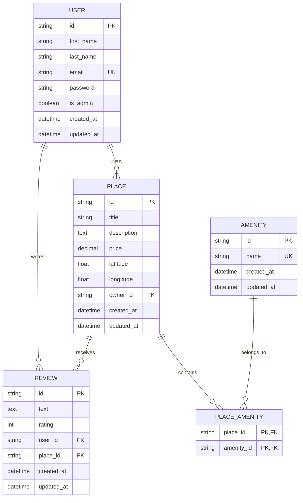
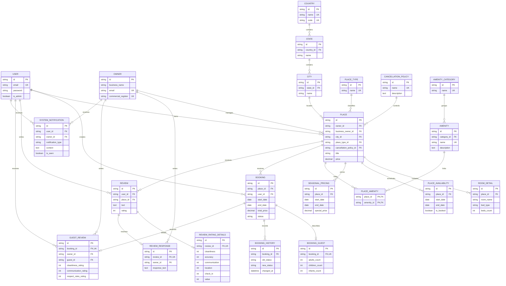

# HBnB Database ER Diagrams

## Required Core Schema

The `PLACE_AMENITY` table implements the many-to-many relationship between
places and amenities. The combination of `user_id` and `place_id` is unique
in `REVIEW`, so one user can review a place only once.

The exported version of the diagram is available in
[`ER_DIAGRAM.png`](ER_DIAGRAM.png).

## Extended HBnB Schema

The project keeps the additional entities designed in Part 1. They extend
the required schema without changing the required User, Place, Review,
Amenity, or Place_Amenity relationships.

