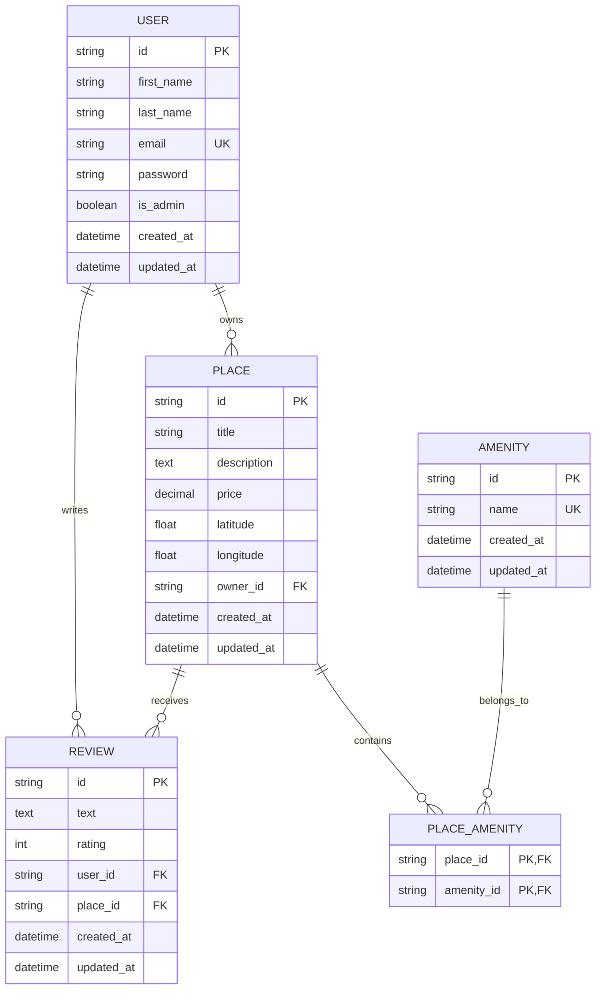

# HBnB Database ER Diagram

The `PLACE_AMENITY` table implements the many-to-many relationship between
places and amenities. The combination of `user_id` and `place_id` is unique
in `REVIEW`, so one user can review a place only once.
